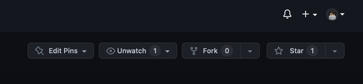

  

 

Technical documentations are the fundamental building blocks of any product yet —_they still remain a pain point for many teams and enterprises_.

- Why they don't have good integration with other third-party services? with GitLab or Bit Bucket?
- Why there is no open source _SaaS provider_ with good data protection policy and self-hosting as a feature?
- Aren't you tired of same old documentation tools with not great UX and a lot of frills? We are. That's why we built something epic.

Introducing **GitWonk**, an open source alternative to GitBook, designed and built focusing on the _developer experience_.

To learn more, visit [gitwonk.com](https://gitwonk.com)

&nbsp;

## Current Status

- [x] Pre-Alpha: We are building the first version of GitWonk (MVP) and testing with a closed set of people
- [ ] Public Alpha: Anyone can sign up over. But go easy on us, there are a few kinks
- [ ] Public Beta: Stable enough for most non-enterprise use-cases
- [ ] Public: Production-ready

## Stay tuned

if you like what we are doing, please consider [starring](https://github.com/gitwonk/gitwonk) the repo. We will be posting updates on our [Twitter](https://twitter.com/getgitwonk) account.

## Contributing

We love our contributors! Here's how you can contribute:

- [Open an issue](https://github.com/gitwonk/gitwonk/issues) if you believe you've encountered a bug.
- To see how to Contribute to the codebase, please visit [Getting Started](./DEVELOPERS.md).

## Community and Support

- [Discord Server](https://discord.gg/XvprRWPZKK). Best for: hanging out with the community.
- [GitHub Issues](https://github.com/gitwonk/gitwonk/issues). Best for: bugs and feature requests for GitWonk
- [Community Forum](https://github.com/gitwonk/gitwonk/discussions). Best for: discussion and general questions about the GitWonk.
- [Email Support](mailto:support@gitwonk.com). Best for: business inquiries, security issues, and other sensitive topics.

## Roadmap

GitWonk is a fairly recent project. It is still in heavy development, so expect breaking changes and buggy features.

TODO: Update this section with the latest roadmap

## Security

If you believe you have found a security vulnerability in GitWonk, we encourage you to responsibly disclose this and not open a public issue. We will investigate all legitimate reports. Email `jayakrishnan@gitwonk.com` to disclose any security vulnerabilities.

[https://gitwonk.com/security](./SECURITY.md)

## Team Behind

- Yeganathan ([@yeganathans](https://twitter.com/yeganathans))
- Jayakrishnan ([@jayakrishnan](https://twitter.com/jayakrishnan))
- Nayan Thara ([@thara0908](https://twitter.com/thara0908))
- Pranav ([@pranav](https://twitter.com/pranav))

## License

Inspired by many of our open-source friends, GitWonk is open source under the GNU Affero General Public License Version 3 (AGPLv3) or any later version. You can [find it here](https://github.com/gitwonk/gitwonk/blob/main/LICENSE.md).
